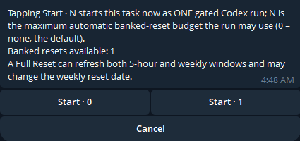
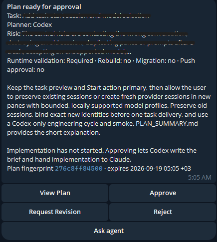
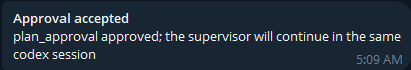
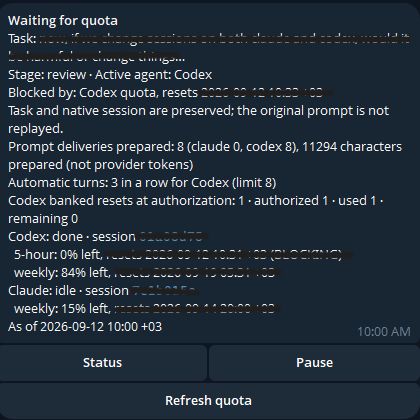
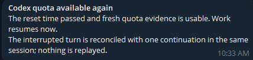

# herdr-supervisor

`herdr-supervisor` is a durable human-in-the-loop workflow supervisor and remote-control layer for coding agents running through [Herdr](https://github.com/herdrdev/herdr). It coordinates persistent Codex and Claude sessions through deterministic state transitions, preserves native conversations, waits for provider quota without model polling, and places human approval gates around consequential stages.

This repository is an independent community companion project. It is not an official Herdr component and is not affiliated with or endorsed by Herdr, Anthropic, OpenAI, or Telegram.

The current candidate version is **0.3.0-beta.1**. Beta status does not relax authorization, redaction, callback replay, prompt-delivery, state-integrity, or approval-hash guarantees.

## Capabilities

- Durable Claude/Codex workflows with native session preservation
- Deterministic lifecycle orchestration and token-free quota waiting
- Five-hour and weekly quota handling with safe, periodic non-LLM rechecks
- Explicit per-task Codex banked-reset budgets with durable idempotent redemption
- Typed plan, question, runtime-validation, and push-approval gates
- Telegram control over outbound HTTPS long polling; no inbound listener or webhook
- Short task text plus confirmed `.md` and `.txt` task-file submissions
- Concise messages plus registered, redacted Markdown result documents
- Read-only `/ask` queries with deterministic answers and dedicated-session failover
- Restart recovery, durable notifications, one-time callbacks, and fail-closed ambiguity handling
- Optional deterministic backup health, snapshot, verification, and isolated restore tooling

It is not another AI agent, an API-model router, a provider-quota bypass, or a tool tied to one project. Telegram controls the supervisor state machine; it does not inject raw keys into agent panes.

## Requirements

- Linux with Python 3.11 or newer; release validation is performed on Python 3.13
- Herdr 0.9.0 or newer installed user-scoped with its executable at `~/.local/bin/herdr`; the installer checks this before writing anything, and the headless server unit runs that path. 0.9.0 is the minimum tested CLI contract; `herdr-supervisor doctor` reports the detected version and probes the required commands/options read-only, so a newer version passes only while that contract holds
- The Herdr plugin [`herdr-agent-quota`](https://github.com/levi-qiao/herdr-agent-quota): it writes the five-hour, weekly, and context quota snapshots the supervisor reads, and provides the non-LLM `refresh` action used to recheck model quota without waking a model
- Codex and Claude CLIs with persistent sessions managed through Herdr; the optional Codex banked-reset feature additionally uses Codex's supported app-server reset-credit interface, which is separate from the quota plugin
- User systemd for detached workers and optional services
- Per feature, optional: outbound HTTPS to `api.telegram.org:443` (Telegram control), `git` (Git recovery assessment), `ssh` and `rsync` (SSH snapshot backups)

Routine installation does not require root. Keeping user services alive after logout may require an administrator to run `loginctl enable-linger USER` once; see [Installation](docs/INSTALL.md).

## Tested scope

This beta has so far been developed and tested with Codex and Claude in one Herdr workspace using two panes. Other providers, larger workspace layouts, and additional operating environments have not yet received the same validation. Broader tests are planned, and bug reports, test results, feature requests, and contributions are welcome.

## Install

```sh
git clone https://github.com/Ejlonn/herdr-supervisor.git
cd herdr-supervisor
./install.sh --dry-run
./install.sh
herdr-supervisor doctor
```

The installer copies reviewed files into user-scoped paths, creates restrictive directories, and installs disabled unit definitions. It does not enable, start, reload, or restart services. Existing config, tokens, and state are preserved.

Configure project paths in `~/.config/herdr-supervisor/config.json`; no Python edit is needed. Configure Telegram interactively without echoing the token:

```sh
herdr-telegram setup --owner-user-id YOUR_NUMERIC_ID --chat-id YOUR_PRIVATE_CHAT_ID
herdr-telegram doctor --network
```

Setup begins in shadow mode. Enable actionable control only after reviewing the doctor result and following [Telegram setup](docs/TELEGRAM.md).

## Daily commands

```sh
herdr-supervisor status
herdr-supervisor run --policy gated_v2 task.md
herdr-supervisor run --policy gated_v2 --codex-reset-budget 1 task.md
herdr-supervisor pause
herdr-supervisor resume
herdr-supervisor cancel
herdr-supervisor done --run-id CURRENT_RUN_UUID --operator-handoff
herdr-supervisor ask-agent --run-id CURRENT_RUN_UUID "why is a rebuild required?"
herdr-supervisor logs
herdr-supervisor doctor
herdr-supervisor refresh-quota --run-id CURRENT_RUN_UUID
```

New tasks preserve both native sessions by default. `--session-policy fresh-codex` starts Codex in a new pane and leaves the old session alive; optional model-profile names must be defined in `session_start.model_profiles`. Telegram keeps the task and final Start action primary and shows fresh choices only after the local pane/start contract is verified. `rebind-sessions` previews or applies explicit pane bindings only when no run or preparation worker is active. If a CLI fresh start stops before run initialization, repeating the exact command reconciles its task-bound preparation; a different command fails closed while that preparation is unresolved. Status shows the preparation ID for inspection before `abandon-session-start --preparation-id ID` or an explicit rebind. Neither command closes the old or newly created sessions. If, during a run, the saved session turns up in another pane, in two panes, or its recorded pane disappears, the supervisor stops in a `Session pane ownership needs repair` wait instead of relocating anything; `repair-owner-pane` (preview, then `--apply`) or the Telegram `Refresh repair preview` / `Apply pane repair` buttons update only the recorded pane for the same session id (see `docs/RECOVERY.md`).

**Fresh Codex** pre-creates a durable native thread through the supported Codex app-server `thread/start` (via the same user-scoped helper journal as banked resets), persists the returned thread id before any pane exists, and then launches `codex resume <thread-id>` in the new pane; the configured model profile is set on the thread, not through a launch flag. Ownership binds only when Herdr reports exactly that thread id, ready and unique, in the new pane, and the task is delivered once afterwards. `thread/start` has no idempotency key: a timeout, crash, or malformed result leaves the preparation reconciling (an orphaned provider thread is accepted over a duplicate) — repeating the same task start adopts a settled helper result, `abandon-session-start` releases the attempt, and nothing is retried automatically. Fresh Codex is offered only when every component is verified read-only: Herdr pane split, agent start, identity observation, and the local Codex app-server, `thread/start` schema, and `resume SESSION_ID`; `doctor` lists each component. Fresh Claude keeps its provider-specific launch.

**Runtime evidence ownership.** Runtime validation is collaborative by default (`runtime_validation_mode: operator_collaborative` in the plan payload): `herdr-supervisor runtime-pass|runtime-fail` and the agent's evidence file only create a durable **proposal** — nothing is recorded, the gate stays pending, no push gate is synthesized. The operator records the result with the Telegram `Record PASS` / `Record FAIL` button on the proposal card or with `herdr-supervisor runtime-confirm --run-id RUN --gate-id GATE --evidence-sha256 HASH --decision PASS|FAIL`; the confirmation is bound to the run, gate, candidate, environment, exact evidence bytes, and live state, and the recorded result is always the evidence file's own result. An actor label on a CLI command grants no operator authority. Only a human-approved plan payload declaring `runtime_validation_mode: automatic_agent` lets the assigned agent record directly. Evidence recorded before this rule on a still-pending gate is shown as an unconfirmed proposal; completed history is untouched. `/status`, `status`, and `doctor` show none / proposed / accepted, the latest result, who acts next, and why the task waits.

Telegram supports `/status`, `/task`, `.md`/`.txt` uploads with Start/Cancel confirmation, `/plan`, `/pending`, `/pause`, `/resume`, `/cancel`, `/logs`, `/doctor`, read-only `/ask`, and `/ask-agent`.

**Ask agent** and **Request revision** are different actions at every human decision. `Ask agent` (`/ask-agent <question>`, the `Ask agent` button, or `herdr-supervisor ask-agent`) sends one read-only question to the same active native session while the pending plan, question, runtime, or push gate — or an unread-result wait — stays exactly as it is; the verified answer comes back as a short summary plus a Markdown document, and the same decision returns with its own controls. Asking never approves, revises, advances, replays the task, or applies a fix; a change the agent recommends starts only with an explicit revision or a new task. `Request revision` (`/revise`) still voids the current gate or result and requires the agent to produce a replacement routing result. If no verified answer comes back, the supervisor stops in a follow-up wait that offers `Retry reading answer` (once, no prompt), `Return to decision`, and `Request revision`; `herdr-supervisor retry-answer` and `return-to-decision` are the CLI forms.

`herdr-supervisor status` and Telegram `/status` show supervisor submission metrics — how many prompts the supervisor has submitted per provider and how many characters — next to the provider quota and context percentages that come from `herdr-agent-quota`. The metrics are controller counts, not provider tokens. Automatic same-provider routing chains are bounded by `max_consecutive_auto_turns` (default 8): the supervisor stops in an action-required wait before preparing turn limit+1; a cross-provider handoff ends the streak and only an authenticated human continuation (`/revise`, an answer, an approval, a recorded runtime result) resets it. Continuation prompts never repeat the task body.

Two completions exist. **Verified completion** is reached only by the agent route after every required runtime and push gate is satisfied. **Operator handoff** (`/done`, its one-time Done button, or the CLI command with the explicit `--operator-handoff` flag) closes a run whose agent reported completion while only human-owned runtime validation or push approval was missing: you perform those actions yourself. The record and every status message say the remaining actions were handed to the operator and were not verified by Supervisor; `/done` grants no push approval, records no runtime evidence, and never claims a push-ready or published state. It is refused while any gate is pending, an agent is working, delivery is uncertain, quota or reset recovery is active, or the request belongs to another run, user, or chat.

## Telegram walkthrough

1. **Start** — the task-start card shows the task text and the banked-reset budget buttons; tapping `Start`
   creates the supervised run and Codex begins planning.

   

2. **Plan ready for approval** — a plan-approval card arrives with Codex's summary, risk, fingerprint, and
   runtime-validation, rebuild, migration, and push-approval requirements. The full plan is available through
   **View Plan**; implementation has not started.

   

3. **Approval accepted** — the one-time `Approve` button is confirmed by the worker; Codex writes the brief and hands
   implementation to Claude in the same sessions.

   

4. **Waiting for quota** — a provider usage limit interrupts a turn; the task and native session are preserved, the
   original prompt is not replayed, and the safe reset time is shown.

   

5. **Codex quota available again** — the recheck finds usable quota and the same session continues from where it
   stopped.

   

## Backups

Backups are optional and disabled by default. A Git remote protects only commits and refs present on that remote; it does not protect modifications, untracked/ignored files, local-only commits, workflow artifacts, or runtime state. SSH snapshots explicitly exclude credentials by default and require later reauthentication.

```sh
herdr-backup setup --strategy ssh_snapshot \
  --source "$HOME/workspace" \
  --destination backup-user@example.net:/srv/backups/herdr-supervisor
# Review the proposed config, then repeat with --confirm.
herdr-backup status
herdr-backup verify
```

Enabling the timer is a separate operator action after configuration is confirmed. See [Backup and restore](docs/BACKUP.md).

## Development and CI

`pip install -e ".[dev]"` installs the pinned tools. The CI workflow (`.github/workflows/ci.yml`) runs on Python 3.11 and 3.13: full `unittest` discovery with branch-aware coverage (threshold 80%), Ruff, mypy over every source module, compilation, shell syntax, sdist/wheel build with inventory reconciliation, the extracted sdist's own suite, wheel entry points, an installer dry run, fixture privacy, version consistency, and secret-marker checks. It has read-only permissions and never contacts Herdr, Telegram, or a model provider.

## Development and release safety

Run the isolated suite from the source root:

```sh
python3 -m unittest discover -s tests -v
python3 -m compileall -q src tests
```

Do not copy a live home-directory installation into a release. Source trees must contain examples only. Before publication, scan filenames, working-tree contents, Git objects, and history for credentials, owner/chat/session identifiers, runtime state, and private workflow artifacts. See [Release checklist](docs/RELEASE.md).

## Uninstall

```sh
./uninstall.sh --dry-run
./uninstall.sh
```

The default preserves all configuration, credentials, and durable state. Purging them requires both `--purge` and `--confirm-purge`, refuses active services, and remains an explicit destructive operator action.

This is fully open-source software under Apache License 2.0 (`SPDX-License-Identifier: Apache-2.0`). There are no dual-license or commercial-use restrictions beyond that license. See [LICENSE](LICENSE).
